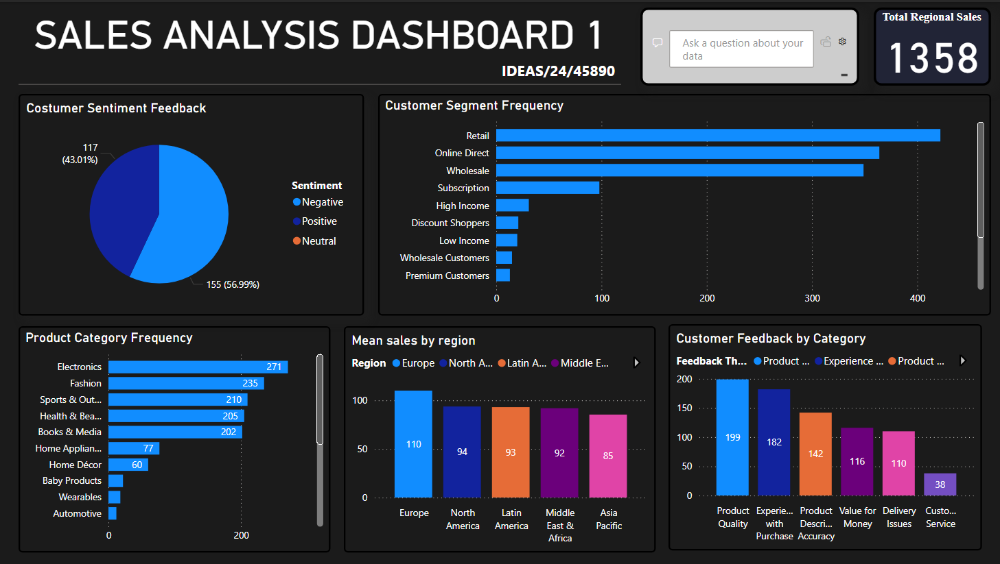

# Sales_Analysis

## Sales Analysis Dashboards
‎
## ‎Overview
‎
‎This repository contains two interactive sales analysis dashboards designed to provide actionable insights into sales performance, customer behavior, and channel efficiency. The dashboards visualize key metrics to support data-driven decision-making.

‎
‎## Dashboard 1: Sales Analysis Dashboard 1

‎
‎Focus: Regional sales, customer segmentation, product category performance, and feedback analysis.
‎

## ‎Key Sections:
‎
‎· Total Regional Sales: Displays overall sales figures.
‎· Customer Sentiment Feedback: Positive vs. negative feedback breakdown.
‎· Customer Segment Frequency: Distribution across customer types (e.g., Retail, Online Direct, Wholesale).
‎· Product Category Frequency: Sales volume by product category (Electronics, Fashion, Sports & Outdoors, etc.).
‎· Mean Sales by Region: Average sales performance across geographic regions.
‎· Customer Feedback by Category: Detailed feedback across themes like Product Quality, Experience, Value for Money, Delivery, and Customer Service.
‎
‎
## ‎Dashboard 2: Sales Analysis Dashboard 2

‎
‎Focus: Sales channel performance, discount impact, return rates, and product-level profitability.
‎

## ‎Key Sections:
‎
‎· Sales Channel Total Frequency: Volume trends (Increase/Decrease/Total) across Online Direct, Retail, and Wholesale.
‎· Sales Channel by Percentage: Proportional contribution of each channel.
‎· Discount Applied per Product: Discount rates by sales channel (Marketplace, Online Direct, Retail, Wholesale).
‎· Return Status by Percentage: Return rates across categories.
‎· Profit Margin by Product Name: Top products by profit margin (e.g., Leather Boots, Air Purifier).
‎· Total Discount Applied per Year: Year-over-year discount trends (2023 vs. 2024).
‎
‎
# # ‎Purpose
‎
‎These dashboards are intended for:
‎
‎· Sales managers monitoring channel and regional performance.
‎· Marketing teams assessing customer segments and sentiment.
‎· Finance and operations teams evaluating discount strategies and profitability.
‎· Executives reviewing overall sales health and return metrics.
‎
‎
## ‎Data Notes
‎
‎· All percentages and figures are based on sample datasets.
‎· "Frequency" refers to transaction or interaction counts unless otherwise specified.
‎· Profit margins and discount rates are calculated at the product or channel level.
‎· Regional data is aggregated and averaged for comparability.
‎
‎
## ‎How to Use
‎
‎1. Review Dashboard 1 for customer and product insights.
‎2. Use Dashboard 2 to analyze sales channels, discounts, and profitability.
‎3. Cross-reference feedback data with return rates to identify improvement areas.
‎4. Track yearly discount trends to inform promotional planning.
‎
‎
## ‎Files Included
‎
‎· Project Dashboard 1.png – Dashboard 1 visual
‎· Project Dashboard 2.png – Dashboard 2 visual
‎
‎
## ‎Recommendations for Action
‎
‎· High-margin products (e.g., Leather Boots) should be promoted in high-performing channels.
‎· Return rates near 40% in certain categories require investigation.
‎· Discount strategies should be aligned with channel profitability.
‎· Customer sentiment should be linked to segment-specific interventions.
